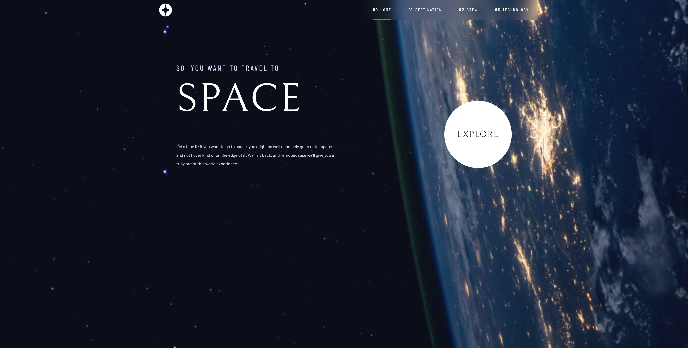

# Frontend Mentor - Space tourism website solution

This is a solution to the [Space tourism website challenge on Frontend Mentor](https://www.frontendmentor.io/challenges/space-tourism-multipage-website-gRWj1URZ3). Frontend Mentor challenges help you improve your coding skills by building realistic projects. 

## Table of contents

- [Overview](#overview)
  - [The challenge](#the-challenge)
  - [Screenshot](#screenshot)
  - [Links](#links)
- [My process](#my-process)
  - [Built with](#built-with)
  - [What I learned](#what-i-learned)
  - [Continued development](#continued-development)
- [Author](#author)

## Overview

### The challenge

Users should be able to:

- View the optimal layout for each of the website's pages depending on their device's screen size
- See hover states for all interactive elements on the page
- View each page and be able to toggle between the tabs to see new information

### Screenshot




### Links

- Solution URL: [https://www.frontendmentor.io/solutions/responsive-space-tourism-website-using-react-reactrouter-7I9Q6NwfmY](https://www.frontendmentor.io/solutions/responsive-space-tourism-website-using-react-reactrouter-7I9Q6NwfmY)
- Live Site URL: [space-tourism-kamil.netlify.app](https://space-tourism-kamil.netlify.app/)

## My process

### Built with

- Semantic HTML5 markup
- CSS custom properties
- Flexbox
- CSS Grid
- Mobile-first workflow
- Context
- [React](https://reactjs.org/) - JS library
- [React Router](https://reactrouter.com/en/main) - JS library
- [Next.js](https://nextjs.org/) - React framework


### What I learned

Firstly I have watched Kevin Powell course on Scrimba. After that, I tried to rebuild the whole page from scratch using React. For most problems, I had to recreate Indicators but with little help, I managed to solve this issue.
Building this project showed how to work with utility classes in CSS and show how they might be useful.
Additionally, I have learned in which situation grid and flex might be used together.

I learn HTML picture tags and when they might be used
```html
<picture>
  <source srcSet={images.webp} type="image/webp" />
  
</picture>
```
Also how to prepare a site to be used with assistive technology and purpose to create Skip To Content Button.


### Continued development

I wasn't able to create content swtich by keyboard

## Author

- Website - [Kamil Szymon](https://github.com/kamiliano1)
- Frontend Mentor - [@kamiliano1](hhttps://www.frontendmentor.io/profile/kamiliano1)

